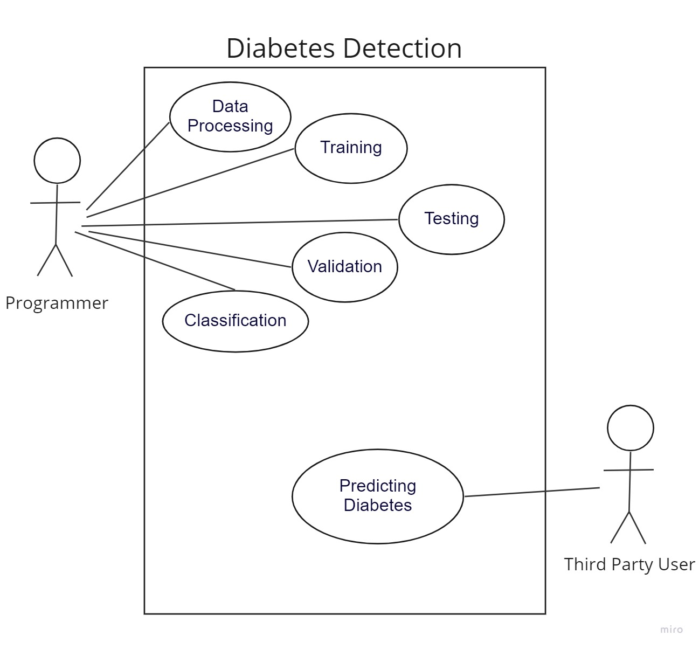
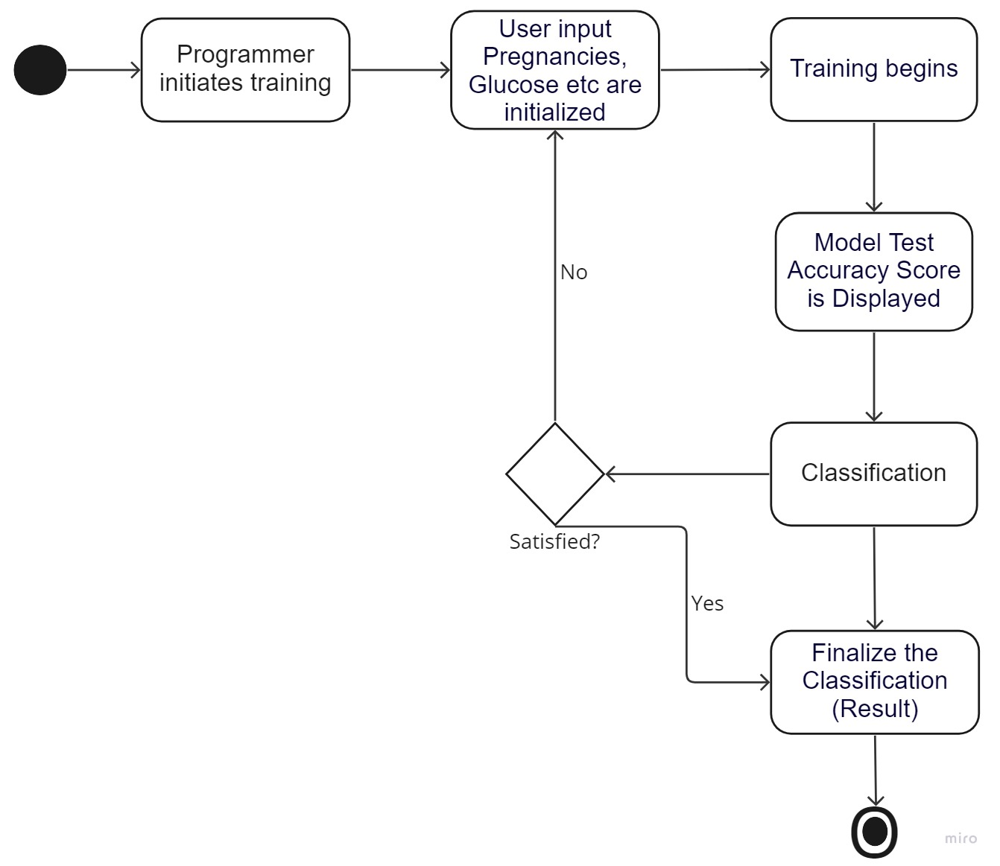
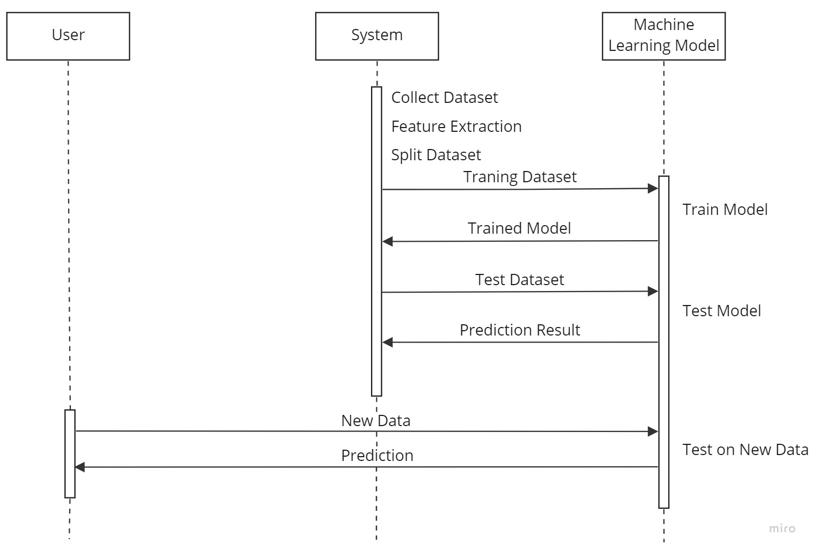
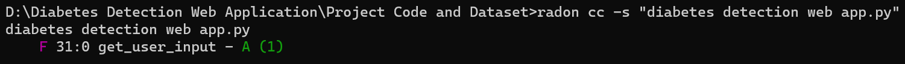
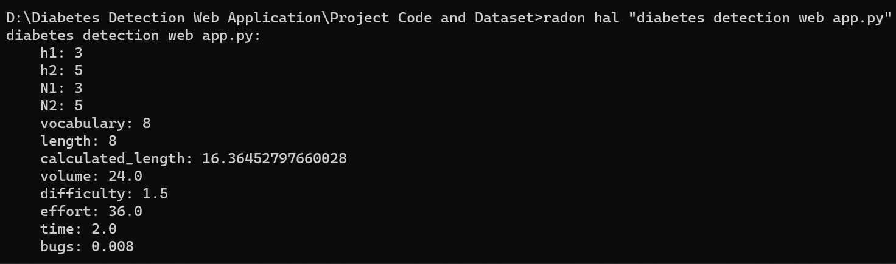
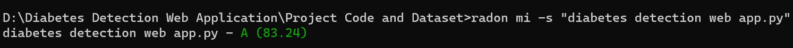
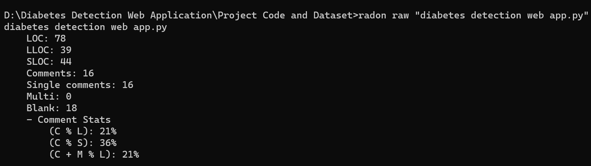

# Project Documentation
 
This is the Documentation for my project.

## 1. git

<a href="https://github.com/ritik8801/Diabetes-Detection-Web-Application">Github Repository</a>

## 2. UML 

The UML Diagrams were made in Miro.
You can find the definitions here: <a href="https://github.com/ritik8801/Diabetes-Detection-Web-Application/tree/main/docs/UML%20Diagrams">UML></a>

### Use Case Diagram

### State Diagram

### Sequence Diagram

## 3. Event-Storming/DDD
<iframe width="768" height="432" src="https://miro.com/app/board/uXjVPpa-1xA=/?share_link_id=345011287833" frameBorder="0" scrolling="no" allowFullScreen></iframe>

## 4. Metrics

### Sonarcloud 

I used <a href="https://sonarcloud.io/project/overview?id=ritik8801_Diabetes-Detection-Web-Application" target="_blank">Sonarcloud</a>, which is sonarqube in the cloud.
It also gives you the ability to embed lot's of different badges:

Also, I used Radon to compute various types of metrics mentioned below:

### 1. Cyclomatic Complexity Metric

Cyclomatic Complexity corresponds to the number of decisions a block of code contains plus 1. This number (also called McCabe number) is equal to the number of linearly independent paths through the code. This number can be used as a guide when testing conditional logic in blocks.
The cc command analyzes Python source files and compute Cyclomatic Complexity. The output can be filtered by specifying the -n and -x flags. By default, the complexity score is not displayed, the option -s (show complexity) toggles this behaviour. File or directories exclusion is supported through glob patterns. Every positional argument is interpreted as a path. The program then walks through its children and analyzes Python files. Every block will be ranked from A (best complexity score) to F (worst one). 

### 2. Halstead Complexity Metric

Halstead Complexity Metric identifies measurable properties of software, and the relations between them.
The hal command analyzes Python source files and computes their Halstead complexity metrics. Files can be analyzed as wholes, or in terms of their top-level functions with the -f flag. Excluding files or directories is supported through glob patterns with the -e flag. Every positional argument is interpreted as a path. The program walks through its children and analyzes Python files.

### 3. Maintainability Index Metric

Maintainability Index is a software metric which measures how maintainable (easy to support and change) the source code is. The maintainability index is calculated as a factored formula consisting of SLOC (Source Lines Of Code), Cyclomatic Complexity and Halstead volume.
The mi command analyzes Python source code files and compute the Maintainability Index score. Every positional argument is treated as a starting point from which to walk looking for Python files (as in the cc command). Paths can be excluded with the -e option. The Maintainability Index is always in the range 0-100.

### 4. Raw Metric

The raw command analyzes the given Python modules in order to compute raw metrics. 
These include:
LOC: the total number of lines of code
LLOC: the number of logical lines of code
SLOC: the number of source lines of code - not necessarily corresponding to the LLOC
comments: the number of Python comment lines (i.e. only single-line comments #)
multi: the number of lines representing multi-line strings
blank: the number of blank lines (or whitespace-only ones)

## 5. Clean Code

My Clean Code Development Pdf: <a href="https://github.com/ritik8801/Diabetes-Detection-Web-Application/blob/main/Clean%20Code%20Development/Clean%20Code%20Development.pdf">Clean Code Development</a>

## 6. Build Management + 8. Continuous Delivery

The build management and continuous delivery are completely cloud based.

I used Github Actions for the build management and continuos delivery because all the services i use integrate extremely well with it. 

My Github Actions Pipeline yaml: <a href="https://github.com/ritik8801/Diabetes-Detection-Web-Application/blob/main/.github/workflows/github%20actions.yml">github actions.yml</a>

### Build Management 

The Github Actions Pipeline runs the unit tests by calling pytest. 

### Continuos Delivery

All Tests are run using pytest and also docs are autogenerated using mkdocs in github actions workflow, these docs are generated into 2nd branch called gh-pages.
There is a technical documentation which you can view here at <a href="https://diabetesdetection.pages.dev/">Technical Documentation</a>.

Also the main documentation code is present at [Documentation Code](https://github.com/ritik8801/Diabetes-Detection-Web-Application/blob/main/docs/index.md)

## 7. Unit-Tests
The [Unit tests](https://diabetesdetection.pages.dev/testing/tests/) are written with the help of the python library pytest.

## 9. IDE
I use visual studio code as main IDE as it has great support for my main languages, namely R and Python.
It also allows you to use the <a href="https://copilot.github.com/">Github Copilot AI</a>, which is great in my opinion. It is especially useful when trying out new things like libraries, because it often comes up with useful suggestions which helps exploring things faster. It has a number of extensions for different tools like sql, docker which helps to upgrade any project. The in-built explorer of vscode is also great as it easily let's you search through all files in your opened directory. You can even replace code across multiple files at once. 

Shortcuts i like:
Shift+Enter is very useful. It runs the selected lines of code in a python terminal in the IDE.
Ctrl+Alt+N is very useful. It runs python file immediately in the IDE.
Otherwise i'm mostly using the standard shortcuts everyone else uses.

## 10. DSL
I created a class that uses the style of the Cars example in moodle:
<a href="https://diabetesdetection.pages.dev/testing/src/modelbuilding/model">"DSL" Class</a>.

## 11. Functional Programming

My Functional Programming Pdf: <a href="https://github.com/ritik8801/Diabetes-Detection-Web-Application/blob/main/Functional%20Programming/Functional%20Programming.pdf">Functional Programming</a>